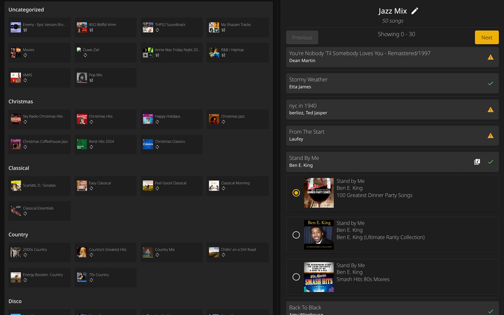

<p align="center"></p>
<h1 align="center">Spotify to Plex</h1>

<p align="center">
  <a href="https://hub.docker.com/r/jjdenhertog/spotify-to-plex"></a>
  <a href="https://github.com/jjdenhertog/spotify-to-plex/stargazers"></a>
  <a href="https://github.com/jjdenhertog/spotify-to-plex/blob/main/LICENSE"></a>
  <a href="https://github.com/jjdenhertog/spotify-to-plex/issues"></a>
</p>

<p align="center">
  A web application to sync your Spotify playlists with <a href="https://plex.tv/">Plex</a>. Automatically match songs, download missing tracks, and keep your music library in perfect sync.
</p>

<p align="center">
  
</p>

---

## Features

- Sync any Spotify playlist with Plex (including Spotify-owned playlists)
- Advanced track matching with multiple search strategies
- Download missing tracks via Lidarr, SLSKD, or Tidal
- Multiple Spotify user support
- Scheduled automatic synchronization
- Smart caching for faster syncs

---

## Quick Start

```sh
docker run -d \
    -e SPOTIFY_API_CLIENT_ID=YOUR_CLIENT_ID \
    -e SPOTIFY_API_CLIENT_SECRET=YOUR_CLIENT_SECRET \
    -e SPOTIFY_API_REDIRECT_URI=https://jjdenhertog.github.io/spotify-to-plex/callback.html \
    -e ENCRYPTION_KEY=YOUR_ENCRYPTION_KEY \
    -e PLEX_APP_ID=eXf+f9ktw3CZ8i45OY468WxriOCtoFxuNPzVeDcAwfw= \
    -v /your/config/path:/app/config:rw \
    --network=host \
    jjdenhertog/spotify-to-plex
```

Access the web interface at `http://[your-ip]:9030`

---

## Documentation

For detailed setup instructions, configuration options, and integration guides:

**[Read the full documentation](https://jjdenhertog.github.io/spotify-to-plex/)**

---

## Support This Open-Source Project

If you appreciate my work, consider starring this repository or making a donation to support ongoing development. Your support means the world to me—thank you!

[](https://www.buymeacoffee.com/jjdenhertog)

Are you a developer with some free time on your hands? It would be great if you can help me maintain and improve this project.

---

## License

This project is open source and available under the [MIT License](LICENSE).
