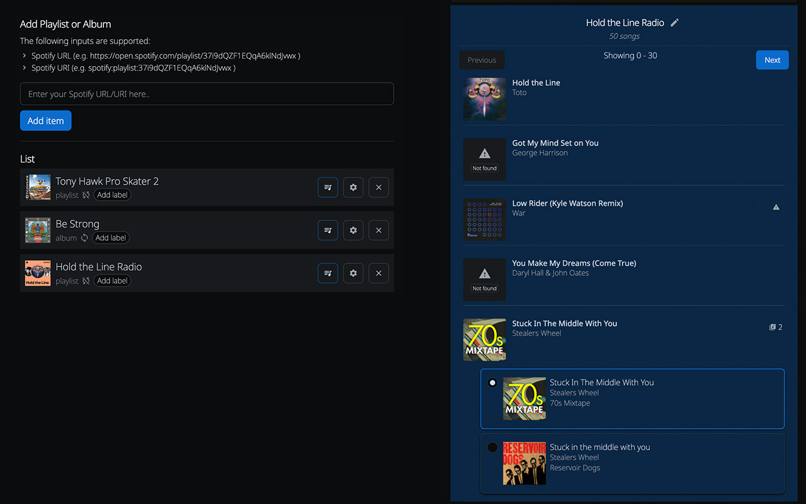
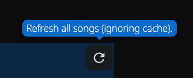
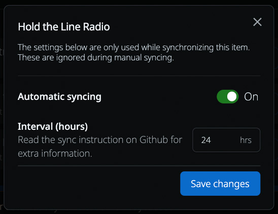
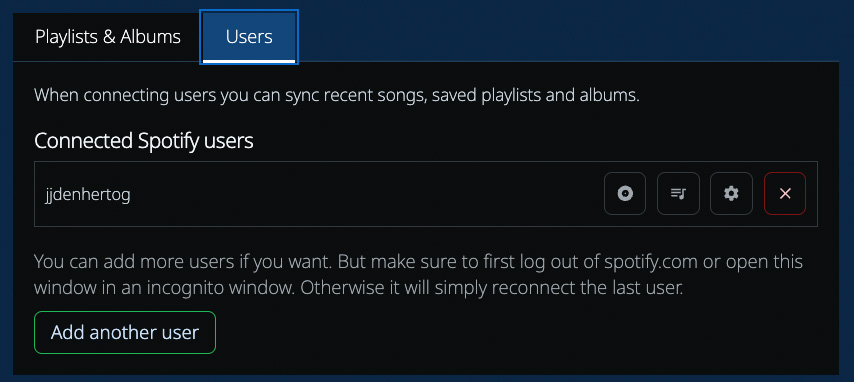

<p align="center"></p>
<h1 align="center">Spotify to Plex</h1>

<p align="center">
  <a href="https://hub.docker.com/r/jjdenhertog/spotify-to-plex"></a>
  <a href="https://github.com/jjdenhertog/spotify-to-plex/stargazers"></a>
  <a href="https://github.com/jjdenhertog/spotify-to-plex/blob/main/LICENSE"></a>
  <a href="https://github.com/jjdenhertog/spotify-to-plex/issues"></a>
</p>

<p align="center">
  A beautiful web application to sync your Spotify playlists with <a href="https://plex.tv/">Plex</a>. Automatically match songs, download missing tracks, and keep your music library in perfect sync.
</p>

<p align="center">
  
</p>

> [!NOTE]
> The recent update might have broken your Plex connection. To resolve this remove `plex.json` and re-authenticate to solve the issue.

---

## Table of Contents

- [Key Features](#key-features)
- [Why Spotify to Plex?](#why-spotify-to-plex)
- [Installation](#installation)
  - [Docker](#docker-installation)
  - [Portainer](#portainer-installation)
- [Quick Start](#quick-start)
- [Matching Songs](#matching-songs)
- [Creating Plex Playlists](#creating-plex-playlists)
- [Synchronization](#synchronization)
- [Spotify App Configuration](#spotify-app-configuration)
- [Spotify User Integration](#spotify-user-integration)
- [Lidarr Integration](#lidarr-integration)
- [Support](#support-this-open-source-project-️)

---

## Key Features

### 🎵 Comprehensive Spotify Sync
Synchronize **any** Spotify playlist with Plex, including:
- **Spotify-owned playlists** (Spotify Song mixes)
- Liked songs
- Personal and private playlists
- Collaborative playlists
- Albums and liked songs
- Recently played tracks and Daylist

Works around Spotify API limitations using [SpotifyScraper](https://github.com/AliAkhtari78/SpotifyScraper) for reliable access to public playlists.

### 🎯 Extensive & Customizable Track Matching
Advanced matching algorithms that find your songs across different formats:
- Multiple search strategies with customizable approaches
- Fuzzy matching for remixes, live versions, and alternative recordings
- Album and artist cross-referencing
- Real-time match quality indicators
- Detailed analysis tool to troubleshoot unmatched tracks

### 📥 Automatic Missing Track Downloads
Never miss a song from your playlists:
- **[Tidal Downloader](https://github.com/jjdenhertog/spotify-to-plex-tidal-downloader)** integration for individual tracks
- **[Lidarr](https://github.com/Lidarr/Lidarr)** integration for complete albums
- Automatic missing track detection and reporting
- Export missing songs as text files with Spotify/Tidal links

### ⚡ Smart Synchronization
Set it and forget it with automatic playlist syncing:
- Scheduled synchronization with customizable intervals
- Sync recently played songs and liked tracks
- Multiple Spotify user support
- Automatic thumbnail updates from Spotify
- Smart caching for faster subsequent syncs

---

## Why Spotify to Plex?

This project started because I'm using Home Assistant together with Plex and Sonos. During the week I'm listening to Spotify but in the evenings and weekends Plex is more often used. Using this application I can automatically synchronize my Spotify songs with my Plex setup.

**What makes this different:**
- Web interface with detailed match information
- Works with Spotify-owned playlists that other tools can't access
- Automatic download integrations (Tidal & Lidarr)
- Multiple Spotify user support
- Complete transparency in how songs are matched

---

## Installation

Install the Spotify-to-Plex app using a Docker container. Once up and running you will find the instance at `http://[ipaddress]:9030`. You can change the port number by setting the `PORT` environment variable.

### Prerequisites

Before you begin, you'll need:

1. **Encryption Key** (required for Spotify user integration)
   ```bash
   openssl rand -hex 32
   ```

2. **Spotify API Credentials** - Get them from the [Spotify Developer site](https://developer.spotify.com/)
   - See [Spotify App Setup Guide](#spotify-app-setup-guide) below for detailed instructions

3. **Tidal API Credentials** (optional) - For matching missing songs with Tidal
   - Register at the [Tidal Developer Portal](https://developer.tidal.com/)

4. **Lidarr API Key** (optional) - For automatic album downloads
   - Find it in Lidarr under Settings → General → Security → API Key

### Docker Installation

```sh
docker run -d \
    -e PORT=9030 \
    -e SPOTIFY_API_CLIENT_ID=PASTE_YOUR_SPOTIFY_CLIENT_ID_HERE \
    -e SPOTIFY_API_CLIENT_SECRET=PASTE_YOUR_SPOTIFY_CLIENT_SECRET_HERE \
    -e SPOTIFY_API_REDIRECT_URI=https://[IP_OF_SPOTIFY_TO_PLEX]:9030/api/spotify/token \
    -e TIDAL_API_CLIENT_ID=PASTE_YOUR_TIDAL_CLIENT_ID_HERE \
    -e TIDAL_API_CLIENT_SECRET=PASTE_YOUR_TIDAL_CLIENT_SECRET_HERE \
    -e TIDAL_API_REDIRECT_URI=https://[IP_OF_SPOTIFY_TO_PLEX]:9030/api/tidal/token \
    -e LIDARR_API_KEY=PASTE_YOUR_LIDARR_API_KEY_HERE \
    -e ENCRYPTION_KEY=PASTE_YOUR_ENCRYPTION_KEY \
    -e PLEX_APP_ID=eXf+f9ktw3CZ8i45OY468WxriOCtoFxuNPzVeDcAwfw= \
    -v /local/directory/:/app/storage:rw \
    --name=spotify-to-plex \
    --network=host \
    --restart on-failure:4 \
    jjdenhertog/spotify-to-plex
```

> **Note:** All data is stored in `/app/storage` - make sure to mount this as a volume for persistent storage.

### Portainer Installation

Create a new stack with the following configuration:

```yaml
services:
    spotify-to-plex:
        container_name: spotify-to-plex
        restart: unless-stopped
        volumes:
            - '/local/directory:/app/storage'
        environment:
            - PORT=9030
            - SPOTIFY_API_CLIENT_ID=PASTE_YOUR_SPOTIFY_CLIENT_ID_HERE
            - SPOTIFY_API_CLIENT_SECRET=PASTE_YOUR_SPOTIFY_CLIENT_SECRET_HERE
            - SPOTIFY_API_REDIRECT_URI=https://[IP_OF_SPOTIFY_TO_PLEX]:9030/api/spotify/token
            - TIDAL_API_CLIENT_ID=PASTE_YOUR_TIDAL_CLIENT_ID_HERE
            - TIDAL_API_CLIENT_SECRET=PASTE_YOUR_TIDAL_CLIENT_SECRET_HERE
            - TIDAL_API_REDIRECT_URI=https://[IP_OF_SPOTIFY_TO_PLEX]:9030/api/tidal/token
            - LIDARR_API_KEY=PASTE_YOUR_LIDARR_API_KEY_HERE
            - ENCRYPTION_KEY=PASTE_YOUR_ENCRYPTION_KEY
            - PLEX_APP_ID=eXf+f9ktw3CZ8i45OY468WxriOCtoFxuNPzVeDcAwfw=
        network_mode: "host"
        image: 'jjdenhertog/spotify-to-plex:latest'
```

---

## Quick Start

1. **Access the web interface** at `http://[your-ip]:9030`
2. **Connect to Plex** using your Plex credentials
3. **Add a playlist** by pasting a Spotify playlist URL
4. **Let it match** - the app will automatically find matching songs in your Plex library
5. **Review matches** - see which songs were found and how they were matched
6. **Create/Update playlist** - sync the matched songs to a Plex playlist

---

## Matching Songs

This app tries to match songs as best as possible using different approaches. When a song can't be matched even though you have it, it's best to raise an issue so I can dive into it. When a song is found but isn't a perfect match you will see a warning.

For Spotify playlist data extraction, this project uses [SpotifyScraper](https://github.com/AliAkhtari78/SpotifyScraper) to fetch playlist information without requiring official API credentials.

### Analyzing Unmatched Tracks

When a song is not getting matched you can analyze the track in the Music Search Configuration (in the Advanced tab). This shows you exactly what is going on and helps identify why a track couldn't be found.

### Missing Songs

You can view all songs that cannot be matched and download it as a text file containing all song links. It is also possible to match them with Tidal - for this you need to setup [Tidal credentials](#prerequisites). Additionally, you can send missing albums directly to Lidarr for automatic download when you have the [Lidarr integration](#lidarr-integration) configured.

### Spotify API Limitations

Due to recent changes to Spotify's Web API (November 2024), many public Spotify-owned playlists can no longer be accessed through the official API. To work around these limitations, this project leverages [SpotifyScraper](https://github.com/AliAkhtari78/SpotifyScraper) for extracting playlist data without requiring API authentication.

While SpotifyScraper provides reliable access to playlist information, it does have some limitations:
- **Track limit**: Playlists scraped through SpotifyScraper are limited to 100 tracks
- **Rate limiting**: Large numbers of requests may be throttled by Spotify's servers

For Spotify-owned playlists with more than 100 tracks, you can copy that entire playlist to a private playlist and use that URL instead.

### Performance & Caching

Most API requests to Plex and Tidal take quite a while, that is why a lot of data is cached. So when a song is matched once, it will not try to match it again. This means that when you reload an existing playlist it will only try to search for the missing songs.

Most requests are made in sets of 5 tracks at-a-time and also cached in that way. So you don't need to wait until all tracks are searched for. When interrupting the process it will have stored any matches that were successfully made.

**Removing cache:** All cached data is stored in `track_links.json` in the storage folder. When removing this file all previously matched tracks will be removed. The other option is to click on the refresh icon on the playlist screen. This will reload the current playlist but ignore any previously matched songs.



**Large playlists:** If you are syncing extremely large playlists (200+ songs) you are prompted to use the `fast` search option. This will scan your library using only the first search approach. For large playlists it's good to know that any matched songs are cached. So there is little harm to interrupting the process. Any songs that were matched will be skipped the next time the synchronization runs.

---

## Creating Plex Playlists

With any imported playlist you have the option to create a playlist or update the existing playlist. In both options the playlist is completely rebuilt, so any changes that you manually made to a playlist will also be removed.

### Changing the Playlist Name

To modify the name of the playlist you can click on the pen icon behind the playlist title and rename it to something else.

---

## Synchronization

You can use Spotify to Plex to automatically synchronize your playlists with Plex. While managing your playlists you have the option to enable automatic syncing and to set the interval in days of how often the synchronization should occur.



> Synchronization can take a very long time (60 minutes +) depending on the setup. Keep this in mind when using it.

### How It Works

The application includes a built-in automatic synchronization scheduler that runs every day around 02:00. You simply need to enable automatic syncing for your playlists and set the sync interval in days. For example, if you set a playlist to sync every 7 days, the scheduler will check daily, but only sync that specific playlist once a week.

### What Happens During Synchronization

During synchronization it does exactly the same as you would do in the app. Which means:
- Open the Plex importer for a playlist
- Try to match all tracks with Plex
- Log any missing tracks
- Update the existing playlist (or create a new one)

It **does not** remember any selection that you made during the process of matching a playlist. So if you chose alternative songs during the first setup it will not apply that same selection.

### Configuration

The synchronization scheduler is automatically enabled when you start the container. No additional setup is required.

**Manual synchronization:**

If you want to manually trigger a sync it is best to use the API calls for this:
- `http://[IP-ADDRESS]:9030/api/sync/albums`
- `http://[IP-ADDRESS]:9030/api/sync/playlists`
- `http://[IP-ADDRESS]:9030/api/sync/users`
- `http://[IP-ADDRESS]:9030/api/sync/lidarr`

### Logs

In the application you can find log entries for each time the synchronization took place - including the duration of each playlist and any error messages.

### Syncing Albums

Album synchronization is included in the automatic scheduler. The syncing service for albums creates `missing_albums_spotify.txt` and `missing_albums_tidal.txt` files in your storage folder. It does not create or update any Plex playlists.

### Missing Songs

The automatic scheduler will update all missing songs in two text files `missing_tracks_spotify.txt` and `missing_tracks_tidal.txt` in your storage folder. You can use these files to easily see which songs are not in your Plex environment.

---

## Spotify App Configuration

To import playlists you need Spotify API credentials. Visit the [Spotify Developer site](https://developer.spotify.com/) to create an app and get your Client ID and Client Secret. More information can be found in the [Getting started section](https://developer.spotify.com/documentation/web-api) of the documentation.

### Configuration

Once you have created your Spotify app, configure the following settings:

- **App Name**: Choose any name for your application
- **App Description**: A brief description of your app (can be anything)
- **Redirect URI**: Must match your `SPOTIFY_API_REDIRECT_URI` environment variable
  - Format: `https://[IP_OF_SPOTIFY_TO_PLEX]:9030/api/spotify/token`
  - Example: `https://192.168.100.130:9030/api/spotify/token`
  - **Important**: Must start with `https` (Spotify requirement)
- **API Scopes**: The app will request the necessary scopes during authentication

### Troubleshooting

**Invalid Redirect URL:**
- Ensure `SPOTIFY_API_REDIRECT_URI` environment variable matches exactly what you set in your Spotify app
- The redirect URI must start with `https` (even for local IP addresses)

**HTTPS Redirect Issue:**
- During authentication, Spotify will redirect to an `https://` URL that may not work
- Simply replace `https` with `http` in your browser's address bar to continue

---

## Spotify User Integration

In the Users section you have the option to add Spotify users. You do not need this for any manual imports, you only need it when you want to do a bit more with Spotify accounts. When you have a connected user you can:

- Easily add albums or playlists saved by that user
- Import user specific or private playlists
- Automatically sync most recent listened songs
- Sync liked songs automatically



### Multiple Users

You can also add multiple users. In order to add multiple users you need to sign out of Spotify before attempting to add the extra user. Alternatively you can also perform this step in an incognito window.

### Security

When you login to your Spotify account the tokens will be stored in `spotify.json` in your storage folder (`/app/storage`). Make sure to properly protect the folder that you are mounting to this app. Sensitive data is encrypted using an [encryption key](#prerequisites) that you can add.

---

## Lidarr Integration

When you have configured the Lidarr integration, you can automatically send missing albums to Lidarr for download. Keep in mind that Lidarr synchronizes albums, not songs. A playlist can easily contain songs from 50+ albums. So this feature will cause a lot of albums to be downloaded by Lidarr.

### Configuration

Once you have set the `LIDARR_API_KEY` environment variable, navigate to the Advanced section and configure your Lidarr settings:

- **Lidarr URL**: The base URL of your Lidarr instance (e.g., `http://192.168.1.100:8686`)
- **Root Folder Path**: Where Lidarr should download music (must match a root folder in Lidarr)
- **Quality Profile ID**: Usually `1` for the default quality profile
- **Metadata Profile ID**: Usually `1` for the default metadata profile
- **Automatic sync**: Can be used to enable the automatic synchronization with Lidarr

### Sending Albums to Lidarr

When viewing missing tracks for a playlist, you'll see a "Send to Lidarr" button that shows how many unique albums are missing.

<p align="center">
  
</p>

---

## Support This Open-Source Project ❤️

If you appreciate my work, consider starring this repository or making a donation to support ongoing development. Your support means the world to me—thank you!

[](https://www.buymeacoffee.com/jjdenhertog)

Are you a developer with some free time on your hands? It would be great if you can help me maintain and improve this project.

---

## License

This project is open source and available under the [MIT License](LICENSE).
