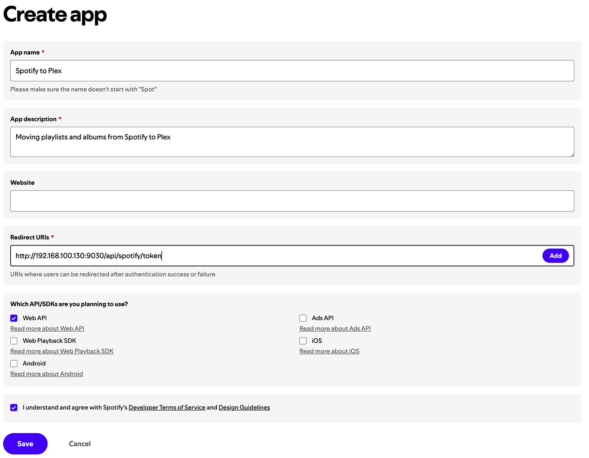
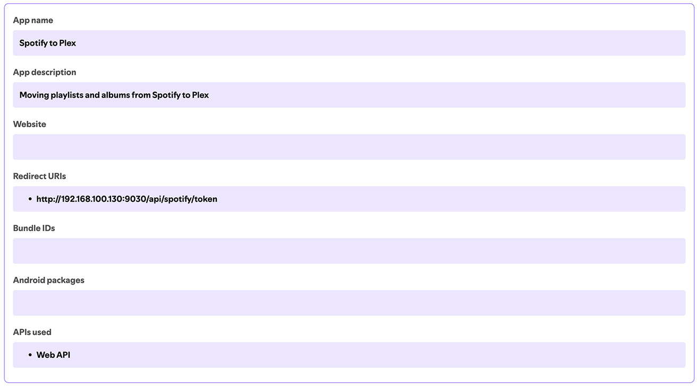
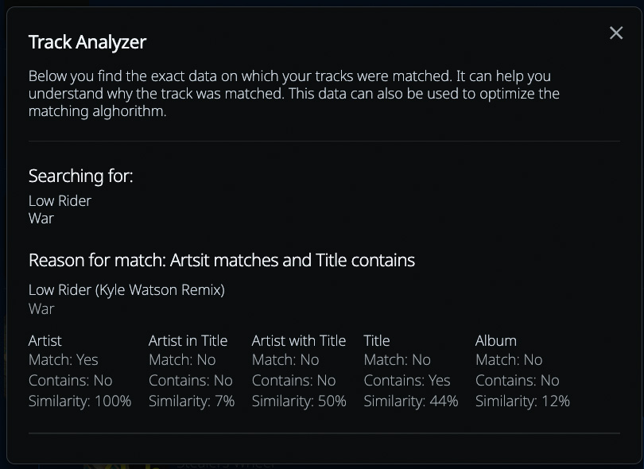

<p align="center"></p>
<p align="center" color="red">Spotify to Plex</p>

------------

A beautiful web application that you can use to sync your Spotify playlists with [Plex](https://plex.tv/). This application uses the data from Spotify (playlists or albums) and tries to find all the matching songs in Plex. With every playlists it gives you an overview of the songs that have been matched and how they have been matched.


This project started because I'm using Home Assistant together with Plex and Sonos. During the week I'm listing to Spotify but in the evening and weekends Plex is more often used. Using this application I can automatically synchronize my Spotify songs with my Plex setup. 

#### Features
* Matching Spotify songs with Plex
* Imported automated personal playlists (e.g. Daylist)
* Export your missing songs (which could be used in [Tidal Media Downloader](https://github.com/yaronzz/Tidal-Media-Downloader))

#### Coming soon
* Automatically synchronize playlists or recent songs
* Update thumbnail in Plex to the Spotify Thumbnail
* Select multiple playlists to set settings
* API route for dashboarding

#### Coming later
* Add albums / playlist by searching Spotify

# Table of Contents
* [Installation](#installation)
  * [Encryption key](#encryption-key)
  * [Spotify credentials](#spotify-credentials)
  * [Tidal credentials](#tidal-credentials)
  * [Binding volume](#binding-volume)
  * [Docker installation](#docker-installation)
  * [Portainer installation](#portainer-installation)
* [Matching songs](#matching-songs)
  * [Missing songs](#missing-songs)
* [Creating Plex Playlists](#creating-plex-playlists)
  * [Changing the playlist name](#changing-the-playlist-name)
* [Speeding things up](#speeding-things-up)
  * [Removing cache](#removing-cache)
  * [Large playlists](#large-playlists)
* [Spotify](#spotify)
  * [Multiple users](#multiple-users)
  * [Security](#security)
* [Synchronization](#synchronization)
  * [Setup](#setup)
  * [Logs](#logs)
  * [Syncing albums](#syncing-albums)
  * [Missing songs](#missing-songs-1)
* [Support This Open-Source Project ❤️](#support-this-open-source-project-️)

------------

## Installation

Install the Spotify-to-Plex app using a docker container. Once up and running you will find the instance at http://[ipaddress]:9030. You can change the port number by setting the `PORT` environment variable.

### Encryption key

When you are using the [Spotify users](#spotify) option it's important to also setup an encryption key. This should be a random string. It is used to encrypt any sensitive data that we receive from Spotify. To get a random key you could use the following command line

```bash
openssl rand -hex 32
```

### Spotify credentials

To import playlists you need Spotify API credentials to make the connection. You can get these credentials at the [Spotify Developer site](https://developer.spotify.com/). More information can also be found at the [Gettin started section](https://developer.spotify.com/documentation/web-api) of the documentation.

For manually adding playlists <b>you don't need the redirect URL</b>. 
The redirect URL is only needed when you want to sync private playlists like your daylist.

#### Creating a new app

The screenshot below shows how you should create the app. 



#### Invalid redirect URL

If you get the message that you have set an invalid redirect URL there are two things to check:

**2. Environment variable**
`SPOTIFY_API_REDIRECT_URI` should be set correctly, for example: `http://192.168.100.130:9030/api/spotify/token`

**1. Redirect URL in the Spotify App**
It should be exactly the same as the environment variable. So in this case: `http://192.168.100.130:9030/api/spotify/token`



### Tidal credentials

If you want to match missing songs with Tidal you also need to use Tidal Credentials. To obtain your Tidal API client ID and client secret, you need to register for access to the Tidal API. Visit the [Tidal Developer Portal](https://developer.tidal.com/) to apply for API access and retrieve your credentials.

### Binding volume

All the data is stored in the `/app/config` folder, you need to add it as a volume for persistent storage.

### Docker installation

```sh
docker run -d \
    -e PORT=9030 \
    -e TIDAL_API_CLIENT_ID=PASTE_YOUR_TIDAL_CLIENT_ID_HERE \
    -e SPOTIFY_API_CLIENT_SECRET=PASTE_YOUR_SPOTIFY_CLIENT_SECRET_HERE \
    -e SPOTIFY_API_REDIRECT_URI=http://[IP_OF_SPOTIFY_TO_PLEX]:9030/api/spotify/token \
    -e TIDAL_API_CLIENT_ID=PASTE_YOUR_TIDAL_CLIENT_ID_HERE \
    -e TIDAL_API_CLIENT_SECRET=PASTE_YOUR_TIDAL_CLIENT_SECRET_HERE \
    -e TIDAL_API_REDIRECT_URI=http://[IP_OF_SPOTIFY_TO_PLEX]:3000/api/tidal/token \
    -e ENCRYPTION_KEY=PASTE_YOUR_ENCRYPTION_KEY \
    -v /local/directory/:/app/config:rw \
    --name=spotify-to-plex \
    --network=host \
    --restart on-failure:4 \
    jjdenhertog/spotify-to-plex
```

### Portainer installation

Create a new stack with the following configuration when using portainer.

```yaml
version: '3.3'
services:
    spotify-to-plex:
        container_name: spotify-to-plex
        restart: unless-stopped
        volumes:
            - '/local/directory:/app/config'
        environment:
            - PORT=9030
            - SPOTIFY_API_CLIENT_ID=PASTE_YOUR_SPOTIFY_CLIENT_ID_HERE
            - SPOTIFY_API_CLIENT_SECRET=PASTE_YOUR_SPOTIFY_CLIENT_SECRET_HERE
            - SPOTIFY_API_REDIRECT_URI=http://[IP_OF_SPOTIFY_TO_PLEX]:9030/api/spotify/token
            - TIDAL_API_CLIENT_ID=PASTE_YOUR_TIDAL_CLIENT_ID_HERE
            - TIDAL_API_CLIENT_SECRET=PASTE_YOUR_TIDAL_CLIENT_SECRET_HERE
            - TIDAL_API_REDIRECT_URI=http://[IP_OF_SPOTIFY_TO_PLEX]:9030/api/tidal/token
            - ENCRYPTION_KEY=PASTE_YOUR_ENCRYPTION_KEY
        network_mode: "host"
        image: 'jjdenhertog/spotify-to-plex:latest'
```
------------

## Matching songs

To match songs with Plex I'm using [plex-music-searcher](https://github.com/jjdenhertog/plex-music-searcher). This tries to match songs as best as possible and taking different approaches. When a song can&apos;t be matched even though you have it, it&apos;s best to raise an issue so I can dive into it. When a song is found but it&apos;t not a perfect match you will see a warning.

When the matched song is indeed totally wrong, you can find more info by clicking on the warning. This tells you why the song was matched. You can use this information to raise an issue so I can look into it.



### Missing songs

You can view all songs that cannot be matched and download it as a text file containing all song links. It is also possible to match it up with Tidal, for this you need to setup [Tidal credentials](#tidal-credentials) as well.

------------

## Creating Plex Playlists

With any imported playlist you have the option to create a playlist or update the existing playlist. In both options the playlists is completely rebuild, so any changes that you manually made to a playlist will also be removed.

### Changing the playlist name

To modify the name of the playlist you can click on the pen icon behind the playlist title and rename it to something else. 

------------

## Speeding things up

Most API requests to Plex and Tidal take quite a while, that is why a lot of data is cached. So when a song is matched once, it will not try to match it again. This means that when you reload an existing playlist it will only try to search for the missing song. 

Most requests are made in sets of 5 tracks at-a-time and also cached in that way. So you don't need to wait until al tracks are searched for. When interrupting the process it will have stored any matches that were successfully made.

### Removing cache

All cached data is stored in `track_links.json` in the data folder. When removing this file all previously matched tracks will be removed. The other option is to click on the refresh icon on the playlist screen. This will reload the current playlist but ignore any previously matched songs. 


### Large playlists

If you are syncing extremely large playlists (200+ songs) than you are prompted to use the `fast` search option. This will scan your library only with one search approach instead of multiple. Find more information about this in [plex-music-searcher](https://github.com/jjdenhertog/plex-music-search).

For large playlists it's good to know that any matched songs are cached. So there is little harm to interrupting the process. Any songs that were matched will be skipped the next time the synchronization runs.

------------

## Spotify

In the Users section you have the option to add Spotify users. You do not need this for any manually imports, you only need it when you want to do a bit more with the Spotify accounts. When you have a connected user you can:

* Easily add albums or playlist saved by that user
* Import user specific or private playlists
* Automatically sync most recent listened songs


### Multiple users

You can also add multiple users. In order to add multiple users you need to sign out of Spotify before attempting to add the extra user. Alternatively you can also perform this step in an incognito window.

### Security

When you login to your Spotify account the tokens will be stored in `spotify.json` in your data folder. Make sure to properly protect the folder that you are adding to this app. Sensitive data is encrypted using an [encryption key](#encryption-key) that you can add.

------------

## Synchronization

⚠️ ⚠️ This is not yet included, [I'm working on this](#coming-soon) ⚠️ ⚠️

------------

You can use Spotify-to-Plex to automatically synchronize your playlists with Plex. While managing your playlists you have the option to enable automatic syncing and to set the interval in hours of how often the synchronization should occur.


### Setup

You need to setup your own task to start the automatic synchronization. To do this, you have two options: 
* Run the action via the command line `npm run sync:playlists`
* Call an API action `http://[ipaddress]:9030/api/sync` 

#### Docker

The preferred approach is by using the docker `exec` command in combination with something like a task scheduler. When using the API action you might run into issues with requests timing out. This really depends per setup, but if you have Spotify to Plex installed on a NAS this would be the go to method. 

```
docker exec spotify-to-plex sh -c "cd /app && npm run sync:playlists"
```

### Logs

In the application you can find log entries for each time the synchronization took place - including the duration of each playlists or any error messages. When you have setup a scheduled task to run the `docker exec` command you can also stream the output to a file. Below you find an example of this setup.

```
docker exec spotify-to-plex sh -c "cd /app && npm run sync:playlists"  > /volume2/Share/spotify_to_plex_playlists.log
touch spotify_to_plex_playlists.log
```

### Syncing albums

The only thing that the syncing service for albums does is create a `missing_albums_spotify.txt` and `missing_albums_tidal.txt` file. It does not create or update any Plex playlists.

### Missing songs

The cronjob will automatically update all missing songs in two text files `missing_tracks_spotify.txt` and `missing_tracks_tidal.txt`. You can do this to easily see which songs are not in your Plex environment. The Tidal songs are also structured in such a way that it could be used in [Tidal Media Downloader](https://github.com/yaronzz/Tidal-Media-Downloader). [Disclaimer](https://github.com/yaronzz/Tidal-Media-Downloader?tab=readme-ov-file#-disclaimer).

------------

## Support This Open-Source Project ❤️

If you appreciate my work, consider starring this repository or making a donation to support ongoing development. Your support means the world to me—thank you!

[](https://www.buymeacoffee.com/jjdenhertog)

Are you a developer and have some free time on your hand? It would be great if you can help me maintain and improve this library.
