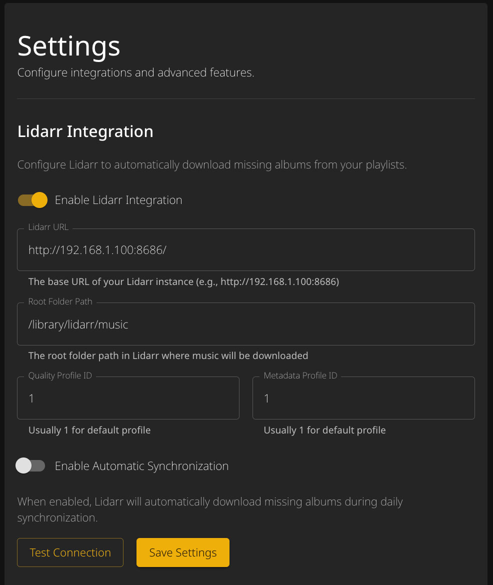
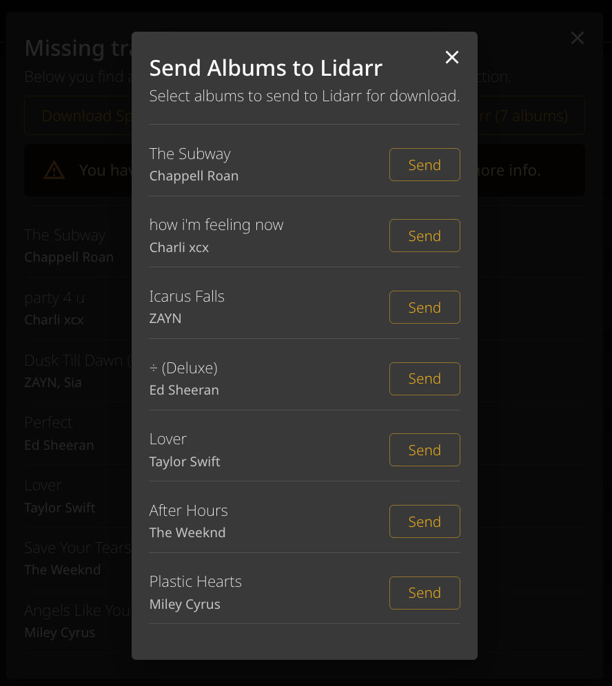

# Lidarr Integration

When you have configured the Lidarr integration, you can automatically send missing albums to Lidarr for download.

{: .warning }
Lidarr synchronizes albums, not songs. A playlist can easily contain songs from 50+ albums. This feature will cause many albums to be downloaded by Lidarr.

---

## Prerequisites

1. A running [Lidarr](https://github.com/Lidarr/Lidarr) instance
2. Lidarr API Key (Settings → General → Security → API Key)

---

## Configuration

### Step 1: Add Environment Variable

```sh
-e LIDARR_API_KEY=YOUR_LIDARR_API_KEY
```

### Step 2: Configure in App

Navigate to **Advanced → Lidarr Integration** and configure:

| Setting | Description |
|---------|-------------|
| Lidarr URL | Base URL of your Lidarr instance (e.g., `http://192.168.1.100:8686`) |
| Root Folder Path | Where Lidarr should download music (must match a root folder in Lidarr) |
| Quality Profile ID | Usually `1` for the default quality profile |
| Metadata Profile ID | Usually `1` for the default metadata profile |
| Automatic sync | Enable automatic synchronization with Lidarr |



---

## Usage

### Sending Albums Manually

When viewing missing tracks for a playlist, you'll see a "Send to Lidarr" button that shows how many unique albums are missing.



### Automatic Sync

When automatic sync is enabled, missing albums are sent to Lidarr during the daily synchronization process.

Trigger manually via:
```
http://[IP-ADDRESS]:9030/api/sync/lidarr
```

---

## Finding Profile IDs

To find your Quality and Metadata Profile IDs:

1. Open Lidarr
2. Go to Settings → Profiles
3. The ID is visible in the URL when editing a profile, or use the Lidarr API
