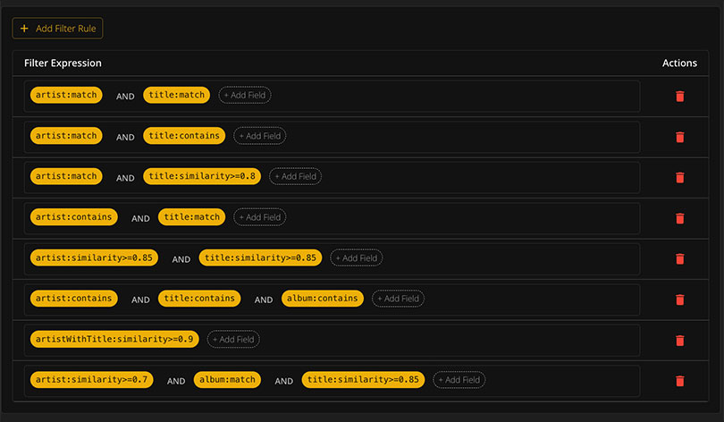
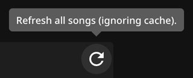

# Track Matching

This app tries to match songs as best as possible using different approaches. When a song can't be matched even though you have it, it's best to raise an issue so we can dive into it.

---

## How Matching Works

The app uses multiple search strategies to find your songs in Plex:

- Artist and track name matching
- Album cross-referencing
- Fuzzy matching for variations (remixes, live versions)
- Multiple search approaches with customizable settings

When a song is found but isn't a perfect match, you will see a warning indicator.

---

## Analyzing Unmatched Tracks

When a song is not getting matched, you can analyze the track in the Music Search Configuration (in the Advanced tab).

This shows you exactly what is going on and helps identify why a track couldn't be found.

---

## Missing Songs

You can view all songs that cannot be matched and:

- Download as a text file containing all song links
- Match them with Tidal (requires [Tidal credentials](installation#3-tidal-api-credentials-optional))
- Send missing albums to [Lidarr](integrations/lidarr) for automatic download
- Search via [SLSKD](integrations/slskd) for P2P downloads

---

## Spotify API Limitations

Due to changes to Spotify's Web API (November 2024), many public Spotify-owned playlists can no longer be accessed through the official API. To work around these limitations, this project leverages [SpotifyScraper](https://github.com/AliAkhtari78/SpotifyScraper) for extracting playlist data.

### Limitations

| Limitation | Details |
|------------|---------|
| Track limit | Playlists scraped through SpotifyScraper are limited to 100 tracks |
| Rate limiting | Large numbers of requests may be throttled |

{: .note }
For Spotify-owned playlists with more than 100 tracks, copy the playlist to a private playlist and use that URL instead.

---

## Performance & Caching

Most API requests to Plex and Tidal take time, so data is cached extensively.

### How Caching Works

- When a song is matched once, it will not try to match it again
- When reloading an existing playlist, only missing songs are searched
- Requests are made in sets of 5 tracks at a time
- You can interrupt the process - matched songs are saved immediately

### Removing Cache

All cached data is stored in `track_links.json` in the storage folder.

**Options:**
1. Delete `track_links.json` to remove all cached matches
2. Click the refresh icon on the playlist screen to reload ignoring cache

### Large Playlists

For extremely large playlists (200+ songs), you're prompted to use the `fast` search option. This scans your library using only the first search approach for better performance.

{: .note }
Any matched songs are cached, so there is little harm to interrupting the process. Matched songs will be skipped on the next sync.
