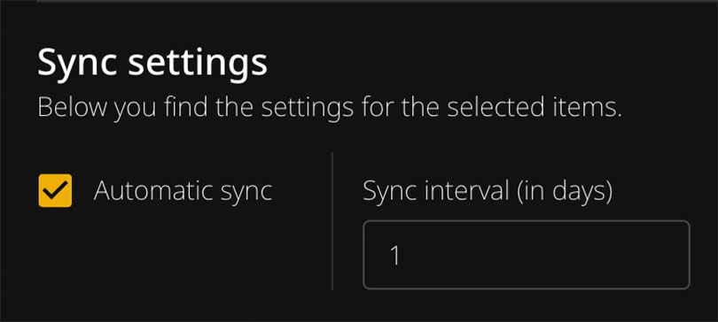

# Synchronization

You can use Spotify to Plex to automatically synchronize your playlists with Plex. Enable automatic syncing for your playlists and set the interval in days.



{: .warning }
Synchronization can take a very long time (60+ minutes) depending on your setup. Keep this in mind when using it.

---

## How It Works

The application includes a built-in automatic synchronization scheduler with multiple jobs:

| Job | Schedule | Description |
|-----|----------|-------------|
| Main sync | Daily at 02:00 | Syncs playlists, albums, and user content |
| SLSKD sync | Daily at 03:00 | Downloads missing tracks via Soulseek |
| Lidarr sync | Daily at 04:00 | Sends missing albums to Lidarr |
| MQTT publish | Every hour | Publishes categorized items to Home Assistant |

{: .note }
All times are based on your configured timezone (`TZ` environment variable) or UTC if not set.

1. Enable automatic syncing for your playlists
2. Set the sync interval in days
3. The scheduler checks daily and syncs when the interval has passed

For example, if you set a playlist to sync every 7 days, the scheduler checks daily but only syncs that specific playlist once a week.

---

## What Happens During Synchronization

During synchronization, the app performs the same steps you would do manually:

1. Open the Plex importer for a playlist
2. Try to match all tracks with Plex
3. Log any missing tracks
4. Update the existing playlist (or create a new one)

{: .important }
The sync does **not** remember any alternative selections you made during manual matching. It will use the default best matches.

---

## Configuration

The synchronization scheduler is automatically enabled when you start the container. No additional setup is required.

---

## Manual Synchronization

To manually trigger a sync, use these API endpoints:

| Endpoint | Description |
|----------|-------------|
| `/api/sync/playlists` | Sync all enabled playlists |
| `/api/sync/albums` | Sync all enabled albums |
| `/api/sync/users` | Sync user-specific content |
| `/api/sync/lidarr` | Sync missing albums to Lidarr |
| `/api/sync/slskd` | Search and download missing tracks via SLSKD |
| `/api/sync/mqtt` | Publish categorized items to MQTT |

Example:
```
http://[IP-ADDRESS]:9030/api/sync/playlists
```

---

## Logs

In the application you can find log entries for each synchronization, including:

- Duration of each playlist sync
- Any error messages
- Missing tracks summary

---

## Syncing Albums

Album synchronization is included in the automatic scheduler.

The syncing service for albums creates these files in your storage folder:
- `missing_albums_spotify.txt`
- `missing_albums_tidal.txt`

{: .note }
Album sync does not create or update any Plex playlists - it only generates the missing albums list.

---

## Missing Songs Files

The automatic scheduler updates missing songs in two text files:

- `missing_tracks_spotify.txt`
- `missing_tracks_tidal.txt`

These files are saved in your storage folder and contain links to songs that couldn't be matched. Use them to:

- Manually find and download missing tracks
- Import into other tools
- Track what's missing from your library

---

## Creating Plex Playlists

With any imported playlist you have the option to create a playlist or update an existing one.

{: .important }
Both options completely rebuild the playlist, so any manual changes you made will be removed.

### Changing the Playlist Name

To modify the name of the playlist, click on the pen icon behind the playlist title and rename it.
